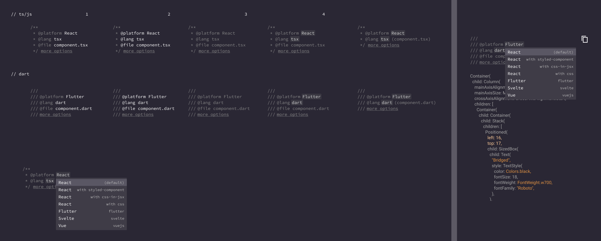

# @code-ui

ui controls seamlessly embedded in code style block

## What is it?



## Installation

```sh
yarn add code-like-ui
# or with npm
npm i code-like-ui
```

## Simple Usage

```tsx
import CodeLikeView from "code-like-ui";

// ...
<CodeLikeView
  lang={"jsx"} // defaults to js - "js" | "dart" | "paython" | LanguageConfig
  style={"monokai"} // default style = monokai
  controls={[
      platform_field,
      lang_field,
  ]}
  expandableConfig={
      lines: 2,
      expandable: true
      hidable: true
  }
  onChange={(field, value) => {
      //
  }}
/>;

//

```

```ts
interface LanguageConfig {
  docstring: {
    start: string;
    mid?: string;
    end: string;
  };
  indent: {
    start?: number;
    mid?: number;
    end: number;
  };
}

type LanguageType = "js" | "dart" | "paython" | LanguageConfig;

const jsstyle: LanguageConfig = {
docstring: {
    start: "/**",
    mid: "*",
    end: "*/",
  },
  indent: {
    mid: 8;
    end: 8;
  };
};


```

## Comlex Example

**creating field**

```ts
const platform_field  = {
    tag: "@"
    name: "platform"
    options: [
        {
            name: "Flutter",
            value: "platform.flutter",
            description: "flutter",
        }
    ]
}
```

## Props

```ts
///
interface Option<T> {
  name: string;
  value: T;
  desc?: string;
}

interface Field<T = string> {
  tag: "@" | "";
  name: string;
  enabled?: boolean;
  // value: string
  options?: Option<T>[];
}
```


## The design

Design resource of code-ui is [avalable here][designlink]. For edit permission, please contact us via universe@grida.co


## Proposals

- [Easy configurable view with json IO](https://github.com/gridaco/code-like-ui/issues/1)

## References

- https://material-ui.com/components/selects/


[designlink]: https://www.figma.com/file/nHJQZjVwnF2dtx153MS9J1/code-ui?node-id=2%3A354

