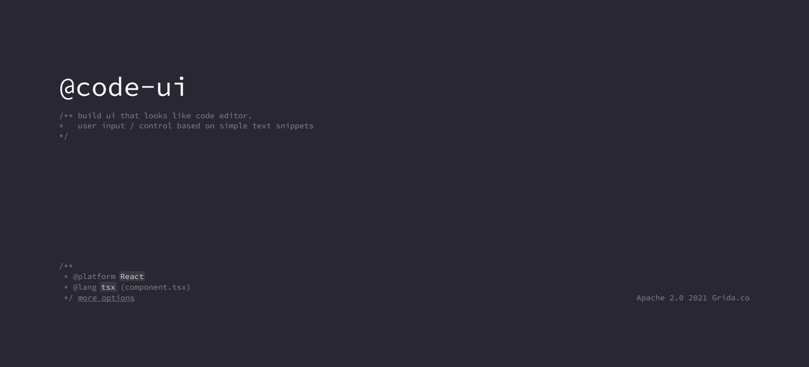
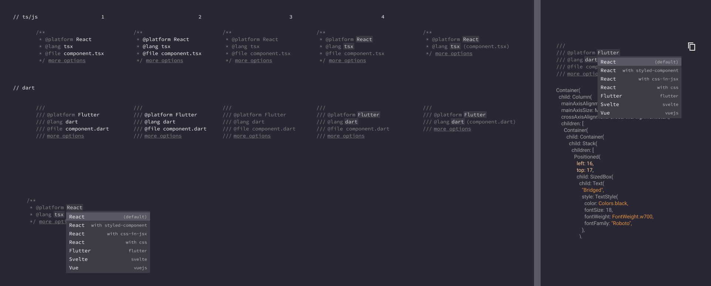

# @code-ui/docstring

ui controls seamlessly embedded in docstring style block

## What is it?



## Installation

```sh
yarn add @code-ui/docstring
# or with npm
npm i @code-ui/docstring
```

## Simple Usage

```tsx
import DocstringView from "@code-ui/docstring";

// ...
<DocstringView
  lang={"jsx"} // defaults to js - "js" | "dart" | "paython" | LanguageConfig
  style={"monokai"} // default style = monokai
  controls={[
      platform_field,
      lang_field,
  ]}
  expandableConfig={
      lines: 2,
      expandable: true
  }
  onChange={(field, value) => {
      //
  }}
/>;

//

```

## Comlex Example

**creating field**

```ts
let lang = "tsx";
const onLangChange = (v) => {
    lang = v
}
const lang_field  = {
    tag: "@"
    name: "lang",
    template?: `{{ tag }}{{ name }}{{ option.name }}`
    options: [
        {
            name: "Flutter",
            value: "platform.flutter",
            description: "flutter",
        }
    ]
}

const platform_field  = {
    tag: "@"
    name: "platform",
    template: `{{ tag }}{{ name }}{{ value }} (juice.${lang})`
    options: [
        {
            name: "Flutter",
            value: "platform.flutter",
            description: "flutter",
        }
    ]
}
```

## Props

```ts
///
interface Option<T> {
  name: string;
  value: T;
  desc?: string;
}

interface Field<T = string> {
  tag: "@" | "";
  name: string;
  template?: string;
  enabled?: boolean;
  // value: string
  options?: Option<T>[];
}
```
